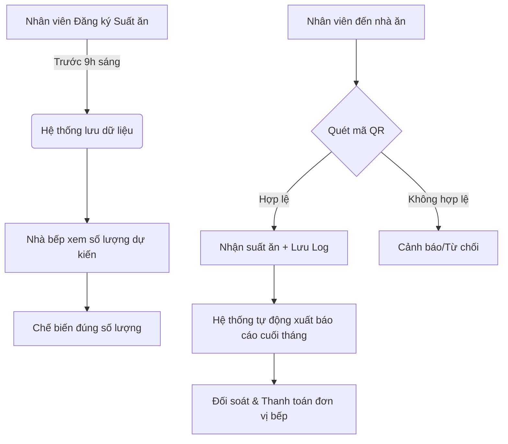

# Đề án: Hệ thống Quản trị Suất ăn thông minh (Meal Management System)

## 1. Tóm tắt dự án (Executive Summary)
- **Mục tiêu**: Tối ưu hóa việc quản lý suất ăn, ngăn chặn lãng phí thực phẩm và minh bạch hóa chi phí ăn uống của doanh nghiệp.
- **Giải pháp**: Ứng dụng công nghệ quét mã QR (QR Check-in) trên thiết bị chuyên dụng và quản lý tập trung trên nền tảng Cloud.
- **Kỳ vọng**: Giảm thiểu 10-15% lãng phí suất ăn thừa và tiết kiệm thời gian đối soát thủ công hàng tháng.

---

## 2. Thực trạng & Vấn đề (The Problem)
Hiện tại, việc quản lý suất ăn đang gặp các vấn đề sau:
- **Lãng phí**: Nhân viên đăng ký nhưng không ăn, hoặc ngược lại, gây khó khó khăn cho nhà bếp trong việc chuẩn bị.
- **Gian lận**: Tình trạng một người ăn nhiều suất hoặc người không có nhiệm vụ vào ăn mà không có cơ chế kiểm soát.
- **Thủ công**: Việc tổng hợp số lượng ăn hàng ngày để thanh toán với đơn vị cung cấp suất ăn tốn nhiều thời gian và dễ sai sót.

---

## 3. Giải pháp đề xuất (Proposed Solution)
Xây dựng hệ thống số hóa toàn diện từ khâu đăng ký đến khâu điểm danh:
1. **Đăng ký tự động**: Nhân viên đăng ký qua App/Web trước giờ G.
2. **Điểm danh tức thời**: Sử dụng máy quét mã QR chuyên dụng tại cửa nhà ăn để xác nhận suất ăn.
3. **Báo cáo thời gian thực**: Ban lãnh đạo và HR có thể xem báo cáo số lượng suất ăn mọi lúc mọi nơi.

---

## 4. Quy trình vận hành (System Workflow)

---

## 5. Dự trù kinh phí (Budget Estimation)

| Hạng mục | Chi tiết | Ước tính (VNĐ) | Ghi chú |
|----------|----------|----------------|---------|
| **Phần cứng** | 02 Máy quét QR 2D cao cấp | 4.000.000 | Hoạt động ổn định, quét nhanh |
| **Hạ tầng** | Cloud Server & Database | 500.000 / tháng | Vận hành ổn định, bảo mật cao |
| **Phần mềm** | Phát triển & Bảo trì | [Tùy chọn] | Tận dụng đội ngũ nội bộ hoặc thuê ngoài |
| **Dự phòng** | Linh kiện thay thế | 1.000.000 | Đầu thu USB, dây cáp |
| **TỔNG CỘNG** | | **~5.500.000** | Chi phí đầu tư ban đầu cực thấp |

---

## 6. Giá trị làm lợi (ROI & Benefits)

### a. Về mặt kinh tế
- **Giảm lãng phí**: Giả sử lãng phí 20 suất/ngày, mỗi suất 35.000đ => Tiết kiệm **~18.000.000đ/tháng**.
- **Thời gian hoàn vốn**: Dự án có khả năng thu hồi vốn đầu tư phần cứng ngay trong tháng đầu tiên triển khai.

### b. Về mặt quản trị
- **Minh bạch**: Loại bỏ hoàn toàn việc "khống" số lượng suất ăn.
- **Tiết kiệm nhân lực**: HR không cần dành 1-2 ngày cuối tháng để cộng sổ, đối check dữ liệu.
- **Trải nghiệm nhân viên**: Hiện đại hóa quy trình, nhân viên thấy được sự chuyên nghiệp của công ty.

---

## 7. Lộ trình triển khai (Roadmap)
- **Tuần 1**: Hoàn thiện phần mềm & Mua sắm máy quét.
- **Tuần 2**: Triển khai thử nghiệm tại 01 nhà ăn (Pilot).
- **Tuần 3**: Truyền thông & Hướng dẫn nhân viên.
- **Tuần 4**: Vận hành chính thức toàn công ty.
