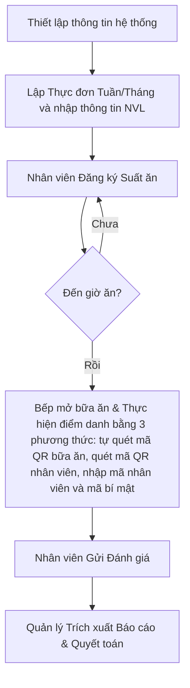
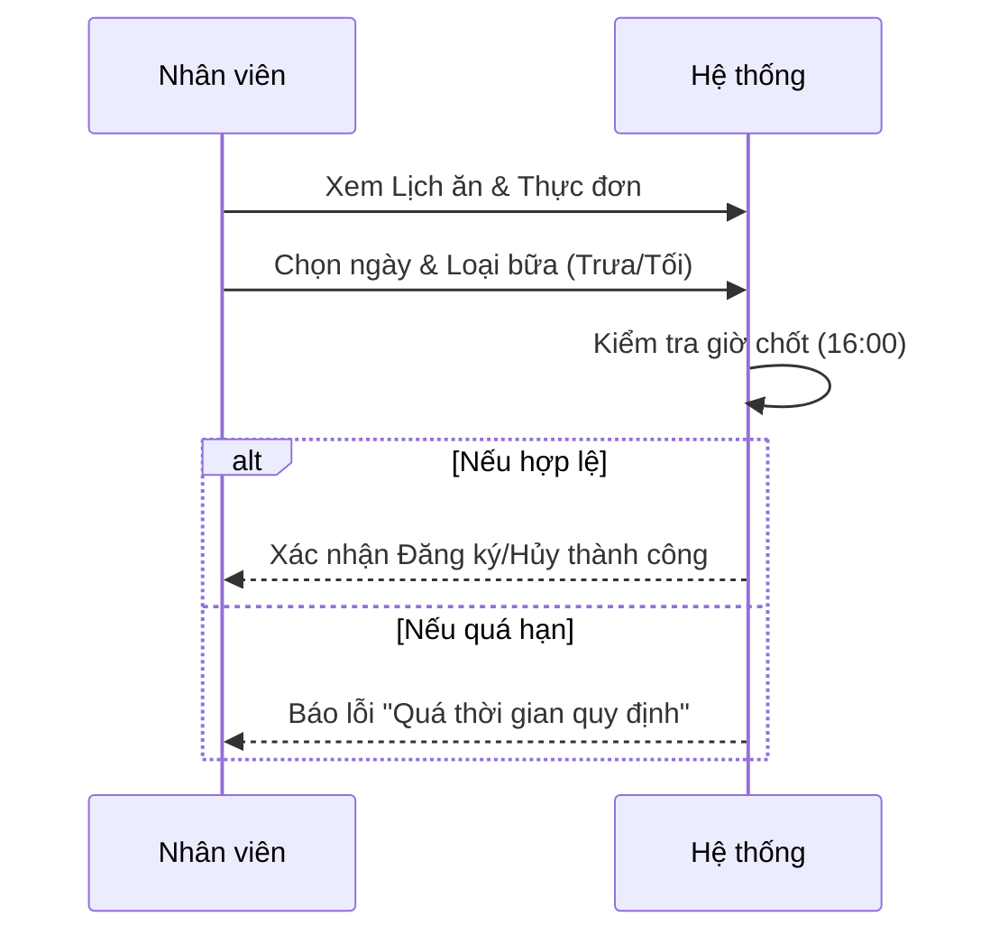
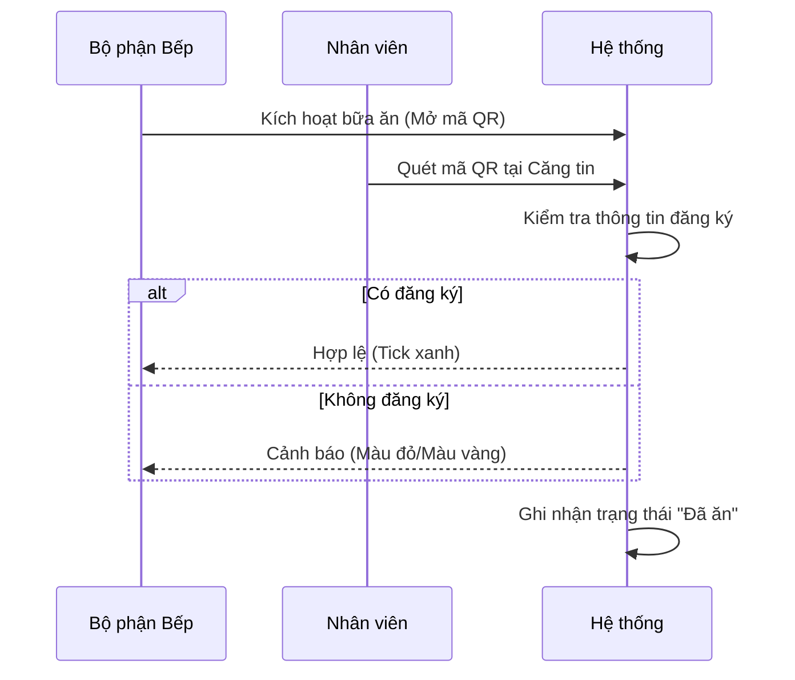

# Quy trình Nghiệp vụ Hệ thống Quản lý Suất ăn

Tài liệu này mô tả luồng quy trình nghiệp vụ tổng thể của hệ thống Quản lý Suất ăn, từ giai đoạn thiết lập đến báo cáo quyết toán.

---

## 1. Tổng quan các Vai trò (Roles)

| Vai trò | Trách nhiệm chính |
|---------|-------------------|
| **Nhân viên (Employee)** | Đăng ký suất ăn, Quét mã QR check-in, Gửi đánh giá/góp ý. |
| **Bộ phận Bếp (Kitchen Staff)** | Lập thực đơn, Theo dõi số lượng (Bảng nhà bếp), Quản lý nguyên liệu. |
| **Quản lý/Admin** | Thiết lập hệ thống (giá, bộ phận), Xem báo cáo tổng hợp, Đối soát chi phí. |

---

## 2. Luồng Quy trình Tổng thể

---

## 3. Quy trình Chi tiết theo Giai đoạn

### Giai đoạn 1: Đăng ký Suất ăn (Registration)
Nhân viên chủ động đăng ký suất ăn cho các ngày trong tương lai.

- **Hình thức**: Đăng ký lẻ theo ngày hoặc Đăng ký nhanh theo mẫu (Preset).
- **Quy tắc Chốt sổ (Cut-off)**: 
  - Trước **16:00** hàng ngày: Có thể đăng ký/hủy cho ngày mai trở đi.
  - Sau **16:00**: Chỉ có thể đăng ký/hủy cho ngày kia trở đi.

### Giai đoạn 2: Chuẩn bị & Chế biến (Preparation)
Bộ phận bếp theo dõi số lượng để chuẩn bị nguyên liệu.

- **Bảng nhà bếp (Kitchen Board)**: Hiển thị thời gian thực số lượng người đã đăng ký chính thức + số lượng khách mời (Guest).
- **Trạng thái bữa ăn**: Nháp (Draft) -> Đang diễn ra (In Progress) -> Hoàn thành (Completed).

### Giai đoạn 3: Phục vụ & Kiểm soát (Serving & Check-in)
Kiểm soát người ăn tại căng tin bằng mã QR.

### Giai đoạn 4: Đánh giá & Báo cáo (Review & Reporting)
Sau khi ăn, nhân viên gửi phản hồi để cải thiện chất lượng.

- **Đánh giá**: Sao (1-5), Bình luận, Hình ảnh thực tế.
- **Báo cáo**: 
    - Báo cáo tổng hợp suất ăn theo bộ phận.
    - Báo cáo chi phí (Số bữa x Đơn giá từng thời kỳ).
    - Danh sách đánh giá chi tiết.

---

## 4. Các Quy tắc Nghiệp vụ Đặc thù

1.  **Hủy đăng ký bởi Bếp**: Trong trường hợp đột xuất (nhà bếp nghỉ, hết khay), Bếp có quyền hủy đăng ký của nhân viên. Khi đó, nhân viên không thể tự đăng ký lại.
2.  **Khách mời (Guest)**: Các bữa ăn tiếp khách được Bếp tạo thủ công và không cần check-in qua app nhân viên (sử dụng mã token riêng).
3.  **Lịch sử Giá**: Đơn giá suất ăn có thể thay đổi theo thời gian. Hệ thống tự động tính toán chi phí dựa trên đơn giá tại thời điểm bữa ăn diễn ra.
